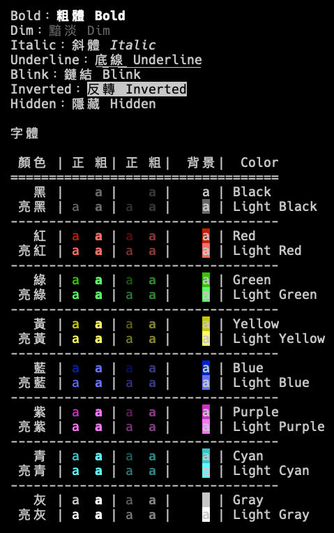
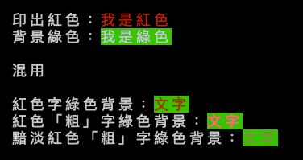

# 歡迎使用 Golang 終端機色彩工具

🌈 Golang Cli 下的色彩工具




## 說明
* 將終端機上輸出的文字給予色彩。


## 使用
``` go
package main

import (
  "fmt"
  "github.com/oawu/Golang-cli-xterm"
)

func main() {
  fmt.Println()
  fmt.Println(fmt.Sprintf("  印出紅色：%s", xterm.Red("我是紅色")))
  fmt.Println(fmt.Sprintf("  背景綠色：%s", xterm.BgGreen("我是綠色")))
  fmt.Println()
  fmt.Println("  混用")
  fmt.Println()
  fmt.Println(fmt.Sprintf("  紅色字綠色背景：%s", xterm.Red("文字").BgGreen()))
  fmt.Println(fmt.Sprintf("  紅色「粗」字綠色背景：%s", xterm.Red("文字").BgGreen().Bold()))
  fmt.Println(fmt.Sprintf("  黯淡紅色「粗」字綠色背景：%s", xterm.Red("文字").BgGreen().Bold().Dim()))
  fmt.Println()
}
```


